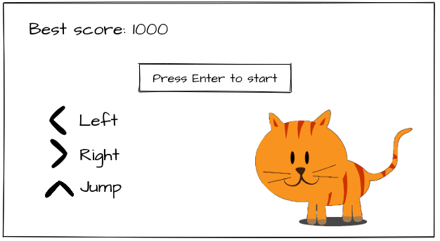
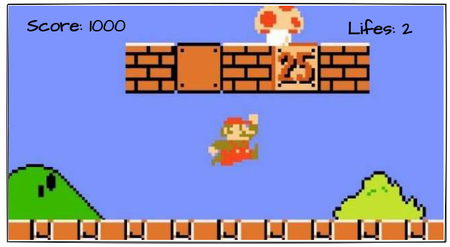

# Игра на PyGame
## Участники
- Калякина Алина Дмитриевна, 520, https://github.com/AlinaKalyakina/PythonDevelopment2021.git
- Маркобородов Андрей Александрович, 521, https://github.com/Markoborodov/PythonDevelopment2021.git
- Фаизов Борис Владимирович, 522, https://github.com/faizovboris/PythonDevelopment2021.git

## Постановка задачи
Реализовать игру. Игрок будет передвигаться по игровому полю. Основное направление движения - вправо. По пути могут встречаться препятствия, которые надо перепрыгивать, могут встречаться противники. У игрока есть жизни, которые убавляются при нападении врагов. Игрок может атаковать противников, прыгая на них сверху. Цель игры - добраться до самой правой точки уровня. После этого программа поздравит игрока. В качестве фреймворка планируется использовать PyGame.

## Интерфейс
На главном меню предлагается начать игру и описывается управление игроком при помощи стрелок:
- Стрелка вверх - прыжок
- Стрелка вправо - двигаться вправо при возможности
- Стрелка влево - двигаться влево при возможности

Предполагаемый макет главного экрана:

Предполагаемый макет игрового процесса:

