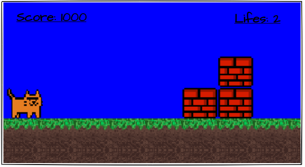

.. Cat game documentation master file, created by
   sphinx-quickstart on Sun Apr 11 12:50:05 2021.
   You can adapt this file completely to your liking, but it should at least
   contain the root `toctree` directive.

Welcome to Cat game's documentation!
====================================
This is a simple PyGame game. The player can move around the playing field. The main direction of movement is to the right. On the way, there may be obstacles that you need to jump over, there may be opponents. The player can attack opponents by jumping on top of them. The goal of the game is to get to the rightmost point of the level. After that, the program will congratulate the player.

Interface
=========
The main menu prompts you to start the game and describes the player's control using the arrows:

- Up Arrow - Jump
- Right arrow - move right if possible
- Left arrow - move left if possible

Estimated layout of the main screen:

Estimated layout of the gameplay:

.. image:: _static/GameplayProposal.png
   :alt: Gameplay Proposal

Game structure
==============

.. toctree::
   :maxdepth: 2
   :caption: Contents:

   modules

Indices and tables
==================

* :ref:`genindex`
* :ref:`modindex`
* :ref:`search`
